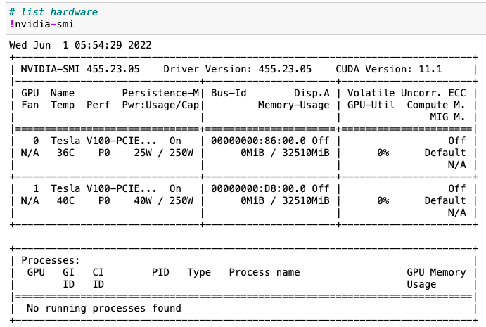
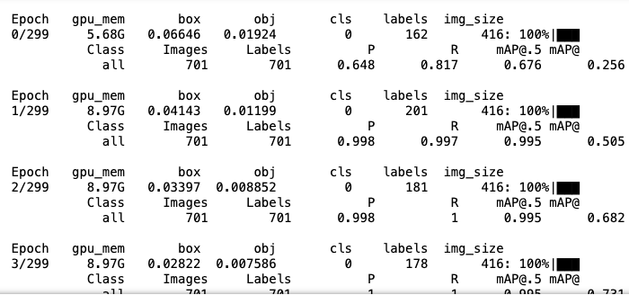
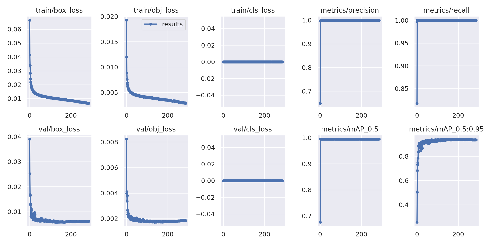
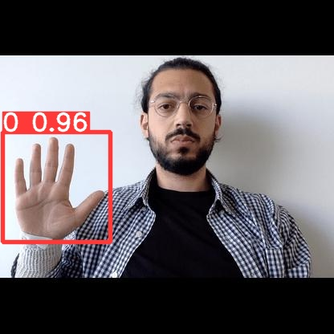
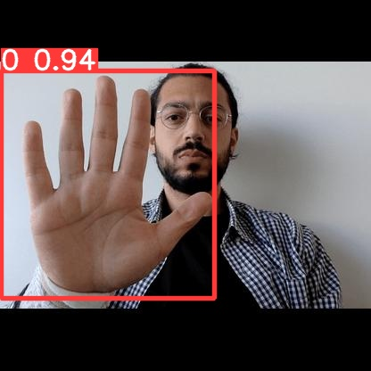
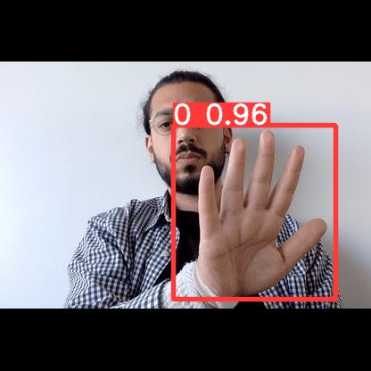
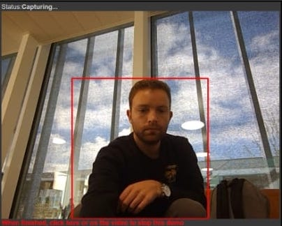
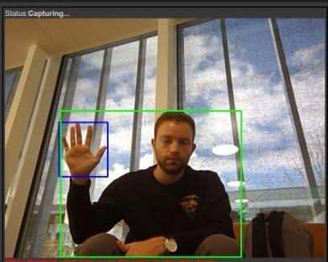
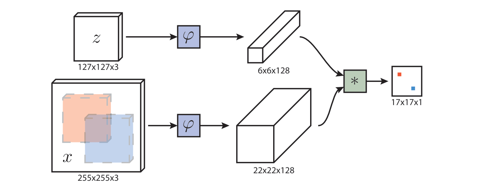
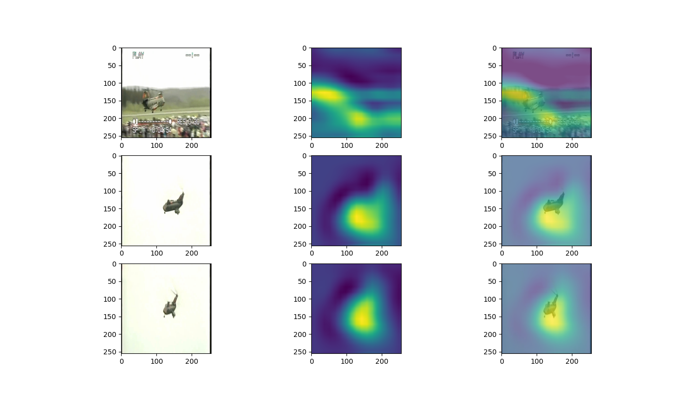

# CIVIL-459: Spring 2022 Final Project

## Autors
Cengizhan Bektas (350828)\
Bastien Darbellay (288406)\
Zakarya Souid 


## Milestone 1

To do object classification we decided to use ***YOLOv5***. YOLO belongs to the One-Stage Detectors family and is the ***state of the art*** algorithm for object detection due to its speed and accuracy. It divides images into a grid system where each cell in the grid is responsible for detecting objects within itself.

### 1) Collecting data

In order to train our custom model, we need to assemble a dataset of representative images with bounding box annotations around the objects that we want to detect. In addition we need our dataset to be in YOLOv5 format.

For this we used the open source model library [Roboflow](https://app.roboflow.com/private-qig8x/dlav-m1/5). We collected about 3.500 images and labeled all of them. To prevent ***overfitting*** and ***generalize*** the model well, we added some ***augmentation*** after resizing all images to 416x416:

- Rotation between -10° and +10°
- Saturation between -10% and +10%
- Brightness between -15% and +15%
- Noise up to 4% of pixels

After adding some augmentation the amount of our images was multiplied by 3 and finally we got more then 10.000 images to train our model.

Split of the data is as follows:

- 80% training
- 15% validation
- 5% test


### 2) Train our custom model

For best training results we have chosen [YOLOv5](https://github.com/ultralytics/yolov5) as object detection architecture with pretrained models on the COCO dataset. In the GitHub project from [Ultralytics](https://ultralytics.com/) we ran a script to train our own model:
```python
!python train.py --img 416 --batch 128 --epochs 300 --data ~/data.yaml --weights yolov5s.pt --cache
```

Here, we are able to pass a number of arguments:

- img: define input image size
- ***batch***: determine batch size
- ***epochs***: define the number of training epochs
- data: location of the dataset
- ***weights***: specify a path to weights to start ***transfer learning*** from. Here we choose the generic COCO pretrained checkpoint.
- cache: cache images for faster training

#### 2.1) Model
There are provided several models with pretrained weights for specific environments. Since we will implement our algorithm on a robot we have chosen the model ***YOLOv5s*** which is recommended for mobile deployments. Larger models like YOLOv5x will produce better results, but have more parameters, require more CUDA memory to train, and are slower to run. We trained our model with default ***hyperparameters*** which are provided in *hyp.scratch.yaml*.

  

<!-- #region -->
#### 2.2) Batch

Batch size is the number of data points used to train a model in each iteration. Choosing the right batch size is important to ensure convergence of the cost function and parameter values, and to the generalization of the model.

It determines the ***frequency of updates***. The smaller the batches, the more, and the quicker, the updates. The larger the batch size, the more accurate the gradient of the cost will be with respect to the parameters. That is, the direction of the update is most likely going down the local slope of the cost landscape. Having larger batch sizes, but not so large that they no longer fit in GPU memory, tends to improve parallelization efficiency and can accelerate training.

As we have been provided with the computing clusters at ***EPFL SCITAS*** with powerful GPU hardware, we used a large --batch-size to get better results. Small batch sizes produce poor batchnorm statistics and should be avoided.

#### 2.3) Insights

Here are the list of hardware components we were provided from the EPFL clusters. In addition, the first results from the first epochs are also showed:

 
<br clear="left"/>
 
<br clear="left"/>

The script to launch the jupyter notebook is as follows:

 
<br clear="left"/>


#### 2.4) Monitor learning process
Training results and metrics are automatically logged and can be found in: ***/m1/yolo/runs/train/exp/results.png***.

 
<br clear="left"/>


**box_loss** represents how well the algorithm can locate the centre of an object and how well the predicted bounding box covers an object. 

**obj_loss** is essentially a measure of the probability that an object exists in a proposed region of interest. If the objectivity is high, this means that the image window is likely to contain an object. 

**cls_loss** gives an idea of how well the algorithm can predict the correct class of a given object.

For all the losses we can see, that these are descreasing with time. The initalization of the parameters are also really well, because we have an optimization directly after the first epoch. The step size of updating the parameters seems also be really good.

***Precision*** is the percentage of samples classified as positives that are truly positives. ***Recall*** is the percentage of positive samples that are correctly classified as positives. The ***mAP*** (mean Average Precision) is a metric to compare the performances of object detection systems. It is the average precision for each class in the data based on the model predictions. Average precision is related to the area under the precision-recall curve for a class. Taking the mean of these average individual-class-precision gives the mean Average Precision. 


#### 2.5) Training script and final model
The trained model can be found in: ***/m1/yolo/runs/train/exp/weights/best.pt***.
The script we have used for train a custom model can be found in: ***/m1/dlav_yolov5_custom_training.ipynb***.

### 3) Measure performance of model

After training the model some inferences were made with the test data to evaluate the custom YOLOv5 detectors performance.

The results can be found in: ***/m1/yolo/runs/detect/exp/***.

Since 5% of our whole data is to test the performance of the detector, there are more than 500 predictions. We just put some of these examples in the folder above to keep the size of the final submission as small as possible.

However, some examples are:

 

 
<br clear="left"/>


### 4) Object detection

In order to do object detection from the output of the webcam, we implemented some functions.
The main idea is, to use the pretrained model from ultralytics to do object detection for each frame. As we are only interested in the person in the frame, we are filtering the pandas dataframe containing only the objects labeled as a person (see figure 1 below). After, we are using our own trained model to detect the gesture in order to detect the ***person of interest***. For this, we are searching for the person in the list of detected persons with the ***biggest interception*** of the rectangles between each person and the rectangle of the gesture. Then we are selecting the person with the biggest overlap (see figure 2 below). To ***avoid unneeded processing***, we are removing all persons in the list which has a smaller area of a specific ***threshold*** we set, to guarantee that we are only interested into the persons which are in the ***foreground***. Finally we are calculating the coordinates of the ***bounding box*** to return the position of the rectangle of the person of interest.

 
 
<br clear="left"/>

The script can be found in: ***/m1/m1.ipynb***.

### 5) Problems

In the beginning we had some problems to collect data in order to train our custom model for the detection of the gesture. Finally we were able to find a huge set of data which were also allocated with the bounding box around the object we want to detect. In addition we initially had problems to train the model due the limited computational power on google colab. For this, we spend a lot of time to set up the environment on SCITAS to train our model without hardware limitations. Because of the fact that we added some augmentation to the data, we didnt have any problems to detect the person of interest in different situations (illuminated room, white background, ...).

Another issue we had, appeared when two persons were one behind the other. The overlapping area of the hand and the persons were equal and could lead to a wrong initialization of the person of interest. To solve this problem, we decided to identify the person of interest not only based on the overlapping area with the hand, but also based on the size of the bounding box of the person. We assumed that the person of interest would be close to the robot and therefore have a bigger bounding box than the persons in the back. With this modification, we were able to accurately detect the person of interest, even in ambiguous conditions.

### 6) Run the code

1) Upload the folder "m1" to your Google Drive
2) Upload the file best.pt to your Google Colab folder on your drive ("drive/MyDrive/Colab Notebooks/")
3) Open m1.ipynb in Google Colab and run each cell one after the other. At the end you should see the feed of your front camera appear.

To change the camera from "front" to "rear", change the facingMode in the forth cell from "user" to "environment". 

## Milestone 2

### 1) SiamFC

We initially planned on trying both DeepSort and SiamFC to acheive Milestone 2. 

SiamFC is a basic tracking algorithms with a fully-convolutional Siamese network. In this approach, a deep conv-net is trained to address a more general similarity learning problem in an initial offline phase, and the coresponding function is then evaluated online during tracking. The Siamese network is trained to located an exemplar image within a larger search image, where the similarity learning is done within the bilinear layers.
We started by implementing SiamFC. 

Siamese Network based tracking algorithms are Single Object Trackers (SOT). We choose to track with SOT because of our needs in this application. We also preferred to not use detection based tracking, which is really common in tracking, because we thought this approach to be more interesting, given we already had to do detection for milestone 1.
A demo version can be seen in the comb.ipynb Jupyter notebook.

We also tried to use SiamMask, a more modern Siamese network implementation. We planned on using it for the race and managed to make it work in Colab. The SiamMaskdemo.ipynb can demo it.

### 2) Principle

Object tracking is a specific field within computer vision that aims to track objects as they move across a series of video frames. The goal of object tracking is to train a model and estimate the target object present in the scene from previous frames. We completed this by taking a starting bounding box coordinate and creating a unique ID for each of the initial detections of the object and tracking them as they move while keeping the unique ID of each object. The specific learning model we used is a Siam-FC model with an AlexNet backend. The model takes in an instance image, and a search image, and uses the backend to process each image into a embedding, then uses cross-correlation to find the search image in the instance image. This project uses the [Lasot] (http://vision.cs.stonybrook.edu/~lasot/) dataset.

Siamese networks differ from most neural networks in that instead of classifying the inputs, they differentiate between two inputs. Siamese networks consist of two neural networks that are from the same class and have the same weights. Those networks are then fed an image pair, which are then fed into a cross entropy loss function that calculates the similarity of two inputs, optimizing the networks.

 

 

### 3) Network

The above image illustrates the SiamFC architecture. A trained image, z, and a search image, x, are passed into identical neural networks. The images are then rescaled and passed into a cross correlation function that generates a score map of the search image and the predictions of the tracked object within the image.

The AlexNet architecture, illustrated above, consists of 5 Convolutional Layers and 3 Fully Connected Layers. The Convolutional Layers extract the object that corresponds to the unique ID within a given image passed through the neural network. The Fully Connected Layers use Max Pooling use pooling windows of size 3x3 with a stride of 2 between the adjacent windows in order to downsample the width and height of the tensors and keep the depth the same between windows. In addition, the Convolutional Layers each use a Rectified Linear Unit (ReLU) Activation function that clamp down any negative values in the network to 0, with positive values unchanged. The result of this function serves as the output of the Convolutional Layer.

A loss function used in this model is a cross entropy loss function. The loss is first computed by taking in two parameters of the same class, the first parameter being 1 or 0 depending on the true value of the model and the second being model's prediction for that class. The loss function then returns the mean logarithm of the negative product between the two parameters and the training code stores the weights at which at the minimum loss occurs.

### 4) Implementation 

All the implementation we found of SiamFC were not real time and only analyzed a pre-recorded video. 
We slightly modified the SiamFC library so it would accept images insted of paths to images and made sure to use the right image format, and wrote a notebook to use it in Google Colab. 

SiamFC needs an array of images to make a prediction. It always looks back at the first reference image to do its "convolution sweeps" on a new image.  
We chose to always give it the first image post detection, the image right before the last one and the most recent image. 
That way, we did not hinder its performances too much and kept positionnal consistency if the subject of the tracking left for a few frames. 

[](https://colab.research.google.com/github/zak-souid/DLAV_project/blob/main/m2/Milestone2demo1.ipynb)

## Milestone 3

For the last milestone we just combined the first milestones and insert this into the detector.py file we were provided for this project. We established a connection to our home directory on the V100 and copied all needed files in order to make to run our implementations. For this we just updated the ***class Detector()*** which was already implemented in the detector.py file. We inserted all the functions we implemented above and called the function for detection and tracking in the ***forward*** method, which is also implemented in the class Detector() inside the detector.py notebook.
<!-- #endregion -->

## Contributing
Pull requests are welcome. For major changes, please open an issue first to discuss what you would like to change.

Please make sure to update tests as appropriate.

## License
[MIT](https://choosealicense.com/licenses/mit/)

